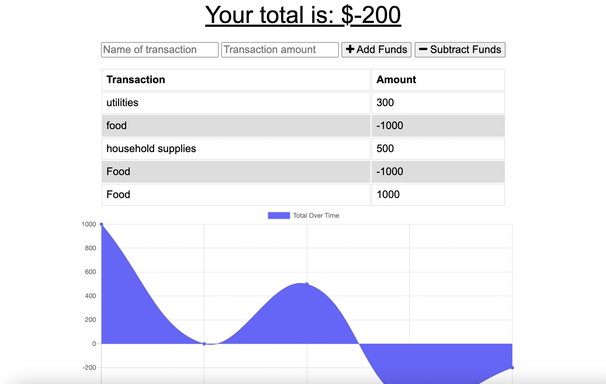

# homework-19-online-offline-budget-tracker

Budget tracker built in the fashion of a Progressive Web Applcation (PWA) that operates online and offline by caching data. Utilizes a database file, service-worker, and a web manifest in order to cache and retrieve data upon use. 

This application can be run vie the Heroku link or by starting it up on a local server. 

